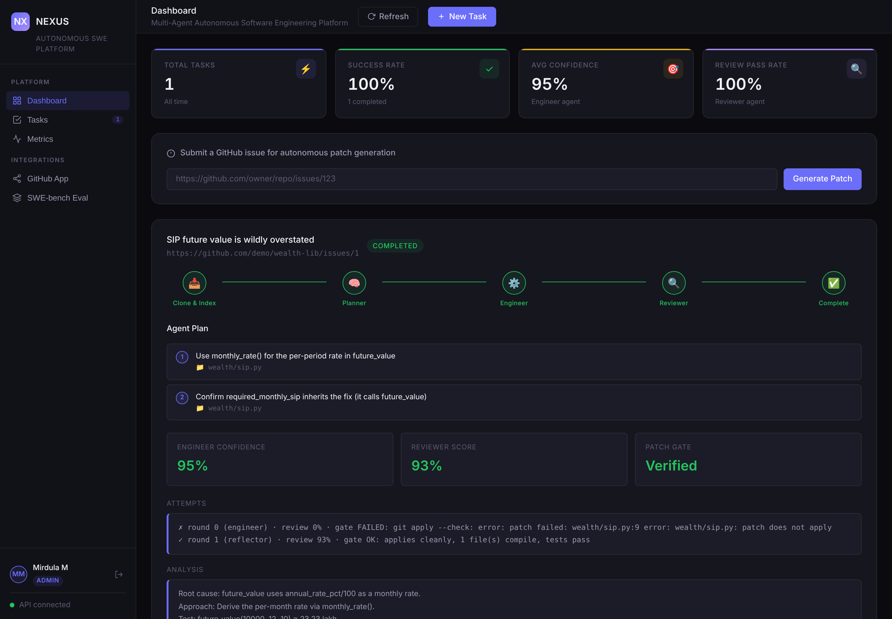
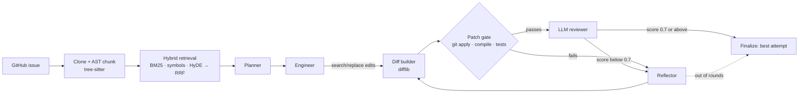

# NEXUS

**Give it a GitHub issue and it returns a patch. The patch is only marked verified after it applies cleanly, compiles and passes the repo's tests.**

[](https://github.com/Mirdumurugesan/nexus/actions/workflows/ci.yml)


NEXUS is a multi-agent pipeline built with LangGraph. A **Planner** breaks the issue into subtasks, an **Engineer** writes a diff from code it retrieves, a **Reviewer** decides whether the diff ships, and a **Reflector** repairs rejected diffs.

The usual weak point in these systems is review: one LLM asks another whether a patch looks right. NEXUS doesn't let a model approve a patch on its own. Before any model reviews a diff, a deterministic **patch gate** runs it against the real checkout.

```
$ python -m app.cli demo          # no API keys, ~2 seconds

  ✗ round 0 (engineer):  gate FAILED: git apply --check: error: patch failed: wealth/sip.py:9
  ✓ round 1 (reflector): gate OK: applies cleanly, 1 file(s) compile, tests pass · review 0.93
  result   VERIFIED · score 0.93 · 1 reflection(s) · 5 LLM calls · 1.3s
```



---

## How it works



| Stage | What it does | Why it's built this way |
|---|---|---|
| **Chunking** | tree-sitter splits Python into functions, classes and methods | A function is never cut in half, so the LLM always sees whole units |
| **Retrieval** | Three rankings fused with Reciprocal Rank Fusion (k=60): BM25 on code, BM25 on *symbols* (path + name), BM25 on HyDE code | Issues often name the function that's broken, and the symbol ranking lets that exact name win. HyDE turns prose into code-shaped queries |
| **Edits, not diffs** | Agents return search/replace blocks; NEXUS finds them in the file (exact → trailing-whitespace → indentation-tolerant, must be unique) and builds the unified diff itself with `difflib` | Models are bad at diff line numbers and some speak their own patch dialects (gpt-oss emitted none of our diffs in the first live run). A search block that isn't found comes back with the closest real line |
| **Patch gate** | `git apply --check` → apply → `compile()` every touched `.py` → optional test command → **always restore the checkout** | These checks are facts, not opinions. A diff that doesn't apply gets score 0, and the LLM reviewer is never called |
| **Reviewer** | Runs only on gate-passing diffs. `passed = gate_ok and score ≥ 0.7`, **computed in code** | The model's own "passed: true" is never trusted |
| **Reflector** | Gets git's or the compiler's exact error, not "seems incomplete" | Concrete errors make the loop converge instead of wander |
| **Finalize** | Returns the **best** attempt, ranked by (gate passed, score) | A reflection round that makes the patch worse can't overwrite a better earlier one |
| **Structured output** | If a provider's function calling fails (Groq `tool_use_failed`), the same model is asked for plain JSON against the schema before failing over | One flaky feature doesn't cost a provider |
| **LLM layer** | One `llm.call(role, ...)` over a provider chain from config (`PRIMARY_LLM=groq/openai/gpt-oss-120b` → `FALLBACK_LLM=google/gemini-3.6-flash`, OpenAI optional). Missing keys are skipped, tokens and cost are counted | Moving providers is a config change. Tests swap in a scripted model by role without patching anything |
| **Budget** | `MAX_TOKENS_PER_TASK` is a hard kill switch: once spent, the loop stops and returns its best attempt | A stuck reflection loop can't burn a quota |

### The demo bug

`demo/fixture` is a small wealth-planning library with a real bug. `future_value()` compounds the annual rate every month, so a ₹10,000/month SIP at 12% for 10 years shows about ₹75 lakh instead of ₹23.2 lakh. Two of its tests fail.

In the default demo the LLM replies are scripted (`--live` uses real models). The first engineer edit targets a line that doesn't exist, which is the most common way LLM edits fail. Everything else is real: the git checkout, retrieval, the LangGraph loop, `git apply`, the compile check and the pytest run.

---

## Run it

```bash
git clone https://github.com/Mirdumurugesan/nexus && cd nexus
python -m venv venv && source venv/bin/activate      # Windows: .\venv\Scripts\Activate.ps1
pip install -r requirements.txt

python -m pytest                     # 86 tests, offline, no keys
python -m app.cli demo               # scripted LLM, real gate
```

With a key in `.env` (`cp .env.example .env`, then set `GROQ_API_KEY` and/or `GOOGLE_API_KEY`; both have free tiers):

```bash
python -m app.cli demo --live                                          # real models on the demo bug
python -m app.cli solve https://github.com/<owner>/<repo>/issues/<n> --out fix.diff
uvicorn app.main:app --reload                                          # dashboard at http://127.0.0.1:8000
```

Nothing else is required. The defaults are SQLite and the in-memory retriever. Postgres/Supabase and Weaviate are opt-in through `DATABASE_URL` and `RETRIEVER=weaviate`. `docker compose up -d postgres weaviate` starts both locally.

### Deploy

`render.yaml` is a Render Blueprint (New → Blueprint → this repo). It builds the `Dockerfile`, generates `SECRET_KEY` and `GITHUB_WEBHOOK_SECRET`, and asks for `DATABASE_URL` plus the Groq and Gemini keys. In production, startup fails if `SECRET_KEY` is still the default.

### GitHub App

Point an app's webhook at `/api/v1/webhook/github` and subscribe to **Issues**. NEXUS starts only when a collaborator adds the `nexus`/`auto-fix` label, never on every opened issue, because each run costs LLM credits. The endpoint stays disabled (503) until `GITHUB_WEBHOOK_SECRET` is set, and every call must carry a valid HMAC-SHA256 signature.

---

## Evaluating on SWE-bench Lite

```bash
pip install datasets
python evals/swebench_eval.py --limit 25
```

Each instance is checked out at its exact `base_commit`, using a cached clone per repo. The script reports:

| Metric | Meaning |
|---|---|
| `gate_pass_pct` | Final patch applies at `base_commit` and compiles |
| `file_hit_pct` | Patch edits a file the gold patch edits (localisation) |
| `retrieval_hit_pct` | A gold file was in the retrieved context |
| `verified_pct` | Passed gate + LLM review |

It **does not** claim "% resolved". That needs each repo's own test environment. Instead it writes `evals/out/predictions.jsonl` in the official format, ready for the SWE-bench harness:

```bash
python -m swebench.harness.run_evaluation --dataset_name princeton-nlp/SWE-bench_Lite \
  --predictions_path evals/out/predictions.jsonl --max_workers 4 --run_id nexus
```

<!-- RESULTS: paste the summary from evals/out/results.json here after a run, with model + date. -->

---

## API

| Method | Endpoint | Auth |
|---|---|---|
| `POST` | `/api/v1/auth/register` · `/login` | — |
| `POST` | `/api/v1/tasks` — submit an issue URL (validated, 202) | engineer |
| `GET` | `/api/v1/tasks/{id}` — status, plan, patch, gate verdict, attempt history | owner / admin |
| `GET` | `/api/v1/tasks?limit=` — your tasks (admins see all) | user |
| `GET` | `/api/v1/metrics` · `/metrics/daily` | user |
| `POST` | `/api/v1/webhook/github` | HMAC signature |
| `GET` | `/api/v1/health` — reports LLM / retriever / gate configuration | — |

Agent runs happen in a worker thread, so a 2-minute run never blocks the event loop. Tasks still in flight when the server restarts are marked failed at boot instead of hanging forever. Logins are throttled (5 failures per minute), and the first account becomes admin.

## Layout

```
app/
  agents/      planner · engineer · reviewer (gate + LLM) · reflector · graph (LangGraph) · state
  tools/       edits.py — search/replace blocks → unified diff (tolerant, unique matching)
               patch_gate.py — git apply / compile / tests, always restores the checkout
               github_parser.py
  rag/         chunker (tree-sitter) · local_index (BM25 + symbols + HyDE, RRF) · retriever · embedder (Weaviate)
  core/llm.py  provider chain (groq · google · openai), role-tagged calls, tokens + cost, test override
  pipeline.py  solve_issue(): one code path for API, CLI and eval
  cli.py       demo · solve
  api/ auth/ db/
demo/fixture/  the buggy wealth library used by the demo and the tests
evals/         SWE-bench Lite runner → harness-format predictions
tests/         86 tests: edit matching, gate against real git, retrieval, fallback chain, budget, agents, end-to-end loop, API, eval
```

## Testing

`python -m pytest` runs 86 tests in about 15 seconds with no network or keys, on Python 3.11 to 3.13 in CI. The tests check behaviour, not just mocks:

- the gate rejects made-up context, broken syntax, a diff that applies but fails tests, and `../` path traversal, and leaves `git status` clean every time
- a reviewer that says 0.99 can't pass a diff that doesn't apply, and isn't even called
- a worse reflection never replaces a better earlier patch
- the provider chain falls through to the next model on errors or unparseable output, counts tokens, and stops the loop when the budget is spent
- users can't see each other's tasks, webhooks without a valid signature or the trigger label do nothing, and logins lock after 5 failures
- the full loop on the demo repo converges in exactly one reflection and 5 LLM calls
- the eval loop writes valid harness predictions, and one crashing instance doesn't stop the run

## Limitations

- The gate's compile check covers Python only. Other languages get `git apply` plus your test command.
- Retrieval is lexical by default. The Weaviate path adds dense vectors but currently uses OpenAI embeddings.
- Single worker: login throttling and agent runs are in-process (no Redis or queue yet).
- No sandbox yet: `GATE_TEST_COMMAND` runs on the host, so only use it on repos you trust.

## License

MIT
